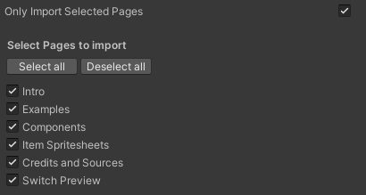

# Unity Figma Bridge


**[WebGL 데모 보기](https://simonoliver.itch.io/unity-figma-bridge)** - 1-Click Import로 생성됨 ([이 Figma Community 파일](https://www.figma.com/community/file/1230440663355118588/Figma-Unity-Bridge-Example) 또는 [실제 Figma 문서 보기](https://www.figma.com/file/DIhmjD8NcAF2UHf69y53fn/Figma-Unity-Bridge-Example?node-id=3%3A1288&t=FojAQsm2ZbnOJL9r-1))

**[예제 Unity 프로젝트](https://github.com/tramper2/Figma_BR_Unity)** - 도구가 생성하는 것을 보여줌

Figma 문서, 컴포넌트, 자산, 프로토타입을 Unity로 쉽게 가져올 수 있습니다! 이 패키지는 Figma 문서를 Unity 프로젝트에 연결하고 모든 자산을 네이티브 Unity UI로 가져오는 것을 매우 간단하게 만들어줍니다.

게임 잼, 빠른 프로토타이핑, Figma 디자인을 Unity로 쉽게 가져오는 데 적합합니다.

**⚠️ 현재 개발 상태**
- **지원 Unity 버전**: Unity 2021.3+ (Unity 6.3 업그레이드 진행 중)
- **최신 버전**: 1.0.9
- Unity 6.3 호환성 업그레이드가 진행 중입니다. [마이그레이션 가이드](Docs/Unity6MigrationGuide.md)를 참고하세요.

**경고** 이것은 @simonoliver의 작업을 한글화및 업데이트 작업중입니다 버그가 있을 수 있습니다. PR을 보내주시거나 🐤[Twitter](https://twitter.com/simonoliveruk) 또는 🐘[Mastodon](https://mastodon.gamedev.place/@simonoliver)으로 메시지를 보내주세요.

현재 **Unity 2021.3** 이상만 지원합니다! (6.3에서 테스트 중 )

---

## 기능

* 네이티브 Unity 객체로 재생성되는 핵심 Figma 요소 지원
* Figma 프로토타입 플로우를 재현하여 Unity 프로토타입을 쉽게 구축, 섹션 포함
* 핵심 Figma 도형(Ellipse, Rectangle, Star)용 SDF 렌더러
* Figma 컴포넌트를 프리팹으로 재생성하고 연결(중첩된 컴포넌트 포함)
* 반응형 레이아웃 및 디바이스 Safe Area 지원
* 필요한 폰트 자산 자동 생성(Google Fonts에서 누락된 폰트 다운로드 포함)
* Figma 객체에 Unity MonoBehaviour 및 필드 바인딩
* 벡터 도형용 서버 측 렌더링
* 오토 레이아웃 지원 (실험적 - 복잡한 레이아웃에서 문제가 발생할 수 있음)
* 스크롤 프레임(overflow 스크롤 설정 사용)

---

## 설정


* Package Manager 창을 엽니다 (Window → Package Manager) → 왼쪽 상단의 **+** 아이콘을 클릭하여 git 패키지를 추가합니다.
* ```https://github.com/tramper2/Figma_BR_Unity.git```를 입력합니다
* Project Settings를 엽니다 (Edit → Project Settings) → **Create**를 클릭하여 새 설정 자산을 만듭니다
* Figma 문서의 URL을 붙여넣습니다 (예: ```https://www.figma.com/design/....../...```)
* [Figma 사용자 프로필 페이지](https://www.figma.com/developers/api#authentication)에서 **Figma Personal Access Token**을 가져옵니다 (Settings → Account → Personal Access Tokens)
* TextMeshPro가 아직 없으면 TMP Essentials를 가져옵니다 (Window → Text Mesh Pro → Import TMP Essential Resources 사용)

---

## 프로토타이핑


기본적으로 임포터는 Figma 파일에서 찾은 프로토타입 플로우를 재현합니다. "Build Prototype Flow"를 끄면 Figma 자산만 생성됩니다.

또한 [Figma의 Sections 동작](https://help.figma.com/hc/en-us/articles/9771500257687-Organize-your-canvas-with-sections)을 구현하여 Figma 섹션을 지원합니다. 각 섹션의 활성 화면은 프로토타입 플레이 중에 기억됩니다.

*Build Prototype Flow*가 선택되면 필요한 자산(Canvas, PrototypeFlowController, EventSystem)을 생성하고 활성 씬에 기본 화면을 인스턴스화합니다. 플레이를 누르면 프로토타입 플로우가 시작되고 버튼이 Figma 문서에 지정된 대로 해당 화면으로 전환됩니다.

---

## Figma 문서 동기화

* **Figma Bridge → Sync Document**를 클릭합니다
* Personal Access Token을 입력합니다 (다음 사용을 위해 Player Prefs에 저장됨)
* 프로토타입 플로우를 생성하기 위해 현재 씬을 사용할지 묻습니다 → 예를 클릭합니다

---

## Figma 페이지 선택



Figma 문서의 특정 페이지만 가져오려면(예: 디자인 노트나 브레인스토밍용 페이지를 사용하는 경우) 설정 파일에서 **"Select Pages to import"**를 체크합니다. 그러면 문서를 다운로드하고 가져올 페이지 목록을 보여줍니다. 이것은 임포트 시간을 단축하고 가져온 자산의 수를 줄이는 데 도움이 될 수 있습니다. 선택되지 않은 페이지는 다음 규칙을 따릅니다:

* 컴포넌트는 여전히 생성됩니다(다른 페이지에서 사용되는 경우)
* 화면은 생성되지 않습니다
* 이미지 채우기는 다운로드되지 않습니다(컴포넌트 내부에 있는 경우 제외)
* 서버 렌더링 이미지는 렌더링되지 않습니다(컴포넌트 내부에 있는 경우 제외)

---

## Figma 객체가 Unity에 매핑되는 방식

| 노드 타입 | Unity 매핑 |
|-----------|-----------|
| **Frames** | 페이지 루트에 배치된 모든 프레임은 "화면"으로 간주되어 *Screens* 폴더에 프리팹으로 저장됨 |
| **Image fills** | PNG로 다운로드되어 스프라이트로 가져오며 *ImageFills* 폴더에 Figma ID 이름으로 저장됨 |
| **Components** | 프리팹으로 생성되며 *Components* 폴더에 저장됨 |
| **Component Instances** | 일치하는 컴포넌트 프리팹을 인스턴스화하고 수정된 속성을 적용함 |
| **Pages** | 각 전체 페이지의 프리팹이 *Pages* 폴더에 저장됨 |
| **Vectors** | PNG로 서버 측에 렌더링됨 (아래 *Server Rendering* 참조) |

---

## 폰트

1-Click 동기화를 목표로 폰트가 프로젝트에 없으면 [Jonathan Neal의 google-fonts-complete 프로젝트](https://github.com/jonathantneal/google-fonts-complete)에서 일치하는 TTF 폰트를 다운로드하려고 시도하고 일치하는 TextMesh Pro 폰트를 생성합니다.

일치하는 폰트를 찾기 위한 대안이 있습니다:

1. 프로젝트에 이미 일치하는 다운로드된 Google Font가 있나요?
2. 없다면, Google Fonts에서 다운로드할 수 있나요(Google Fonts 다운로드가 활성화된 경우)?
3. 그렇지 않으면 프로젝트에서 가장 적합한 것을 찾습니다(이름으로 일치하는 폰트를 찾은 다음 가중치 일치)

Shadow 및 Stroke 설정을 적용하기 위해 임포터는 필요에 따라 Material 프리셋을 생성합니다.

TextMeshPro가 외곽선을 처리하는 방식 때문에 패키지는 사용자 정의 셰이더(**Figma/TextMeshPro**)를 적용합니다. 이것은 외곽선에 "outside" 위치를 사용합니다(Figma의 기본값). TextMeshPro가 보통 사용하는 "center"가 아닙니다(향후 3가지 위치를 모두 지원할 예정)

---

## 색상 공간

패키지는 Gamma와 Linear 렌더링을 모두 지원하지만 다음 사항을 고려해야 합니다:
* 사용된 모든 텍스처는 "sRGB"가 체크되어 있어야 합니다. 임포터가 자동으로 이 작업을 수행합니다(1.0.8 이상). 이전 버전에서 업그레이드하는 경우 다시 가져오거나 수동으로 수행해야 합니다.
* TextMeshPro 셰이더는 현재 Linear 색상 공간에서 정확하게 렌더링하지 않습니다. 이는 향후 업데이트에서 해결할 예정입니다

---

## 자산 내보내기

* 객체가 내보내기로 표시되면 이미지로 렌더링하고 PNG로 다운로드하며 객체 이름과 일치하는 경로에 배치합니다. 여기에는 파일 경로가 포함될 수 있습니다. 예를 들어 노드 이름을 "Textures/Icon/GameIcon"으로 지정하면 PNG 파일을 "Assets/Textures/Icon/GameIcon.png"에 씁니다

---

## 서버 렌더링

문서가 로드되면 서버에서 렌더링해야 하는 노드를 찾습니다. 렌더링은 설정 파일의 *Server Render Image Scale*로 설정된 배율로 수행됩니다(기본값은 3). 현재 다음 경우에 해당합니다:

* 객체가 벡터 도형인 경우
* 객체가 벡터 도형 자식 노드만 포함하는 프레임인 경우
* 객체 이름에 "render"가 포함된 경우

서버 렌더링이 많이 표시되면 Figma 문서를 최적화할 수 있는 방법을 확인하세요(예: 모든 벡터를 컴포넌트에 배치하여 한 번만 렌더링)

---

## 반응형 레이아웃

화면은 제약 조건 패널에 설정된 제약 조건에 따라 동작하지만 "Scale" 제약 조건은 예외입니다. *SafeArea* 컴포넌트를 사용하여 Safe Area를 사용하는 디바이스(예: iPhone)의 Safe Area를 자동으로 조정할 수 있습니다(*Binding Behaviours* 참조)

---

## 오토 레이아웃

가로 또는 세로 레이아웃 그룹이 추가되어 Figma 문서의 객체 오토 레이아웃 설정을 미러합니다. 복잡한 레이아웃에서 문제가 발생할 수 있으므로 기본적으로 비활성화되어 있습니다(설정에서 활성화)

---

## 동작 바인딩

Figma와 동기화하면 기존 컴포넌트와 화면을 대체하므로 패키지는 동기화 시 자동으로 동작을 추가하는 것을 쉽게 만듭니다.

MonoBehaviour를 컴포넌트와 화면에 자동으로 바인딩하고 메서드를 버튼 클릭에 바인딩할 수 있습니다. 임포터는 리플렉션을 사용하여 다음을 수행합니다:


* MonoBehaviour가 객체 이름(대소문자 구분 안 함)과 일치하면 자동으로 추가됩니다. 예를 들어 "PlayScreen"이라는 프레임이 있고 "PlayScreen"이라는 MonoBehaviour가 있으면 해당 MonoBehaviour가 동기화 시 자동으로 추가됩니다
* 연결된 MonoBehaviour에 SerializeField가 있는(공개 또는 SerializeField 속성 사용) 경우 임포터는 일치하는 컴포넌트를 찾기 위해 depth 2까지 검색합니다. 예를 들어 ```public TextMeshPro_UGUI Title```을 추가할 수 있고 "Title"이라는 텍스트 객체가 있으면 해당 필드에 할당됩니다


* ```[[BindFigmaButtonPress("PlayButton")]]``` 속성을 메서드에 추가하면 해당 이름의 버튼(onClick 리스너)에 추가됩니다(depth 2 내에서 검색)

일부 특수한 경우 컴포넌트가 자동으로 추가됩니다:

* 객체 이름에 "Button"이 포함되거나 활성화된 프로토타입 링크가 있으면 Button 컴포넌트를 추가합니다
* 객체 이름이 "SafeArea"이면 Safe Area 컴포넌트를 추가합니다(직사각형이 아닌 화면을 가진 전화기 등에 유용)

Button이 추가되면 "selected"라는 자식 노드를 찾습니다. 이것이 발견되면 rollover 상태에 사용됩니다.

---

## 전환

FigmaScreenController는 전환 안팎의 애니메이션을 구현하는 TransitionEffect를 가질 수 있습니다. 기본적으로 템플릿 fade to black 효과가 생성되지만 교체하고 할당할 수 있습니다.

---

## 의존성

이것들은 패키지가 추가될 때 자동으로 가져와야 합니다

* TextMeshPro 2.0.1
* JSON.Net 2.0.1

---

## 기타

Personal Access Token을 변경하려면 **Figma Bridge → Set Personal Access Token**을 사용하세요

---

## 크레딧

사용:
* [Inigo Quilez의 2D SDF 함수](https://iquilezles.org/articles/distfunctions2d/)
* [krzy의 UnityWebRequestAwaiter](https://gist.github.com/krzys-h/9062552e33dd7bd7fe4a6c12db109a1a)
* [Jonathan Neal의 google-fonts-complete 목록](https://github.com/jonathantneal/google-fonts-complete)

온라인으로 공유해주셔서 대단히 감사합니다!

---

## 현재 지원되지 않는 기능(6.3에서 계속 수정할 예정)

* 사용자 정의 자산 저장 위치
* 이미지 트윽(노출, 대비)
* 그림자 블러
* 타원 sweep angles 및 fill ratio
* 대부분의 효과(내부 그림자, 레이어 블러, 배경 블러)
* 단일 객체에 여러 채우기
* 단색 이외의 획 스타일
* 도형의 획 위치(외부/중앙)
* 텍스트의 획 위치(내부/중앙)
* 동적 장치 폰트 생성
* 비디오 채우기
* 5개 꼭짓점 및 기본이 아닌 반경을 가진 별 모양(API에서 누락된 데이터)
* 별 모양은 균일한 배율로만 렌더링됨
* 다각형 도형
* 불리언 연산
* 선/화살표
* 일관된 UUID
* "Scale" 제약 조건 지원

---

## 문서

프로젝트 분석 및 API 문서는 [Docs 폴더](Docs/)를 참조하세요:

- [프로젝트 분석](Docs/ProjectAnalysis.md) - 클래스별 기능, Unity 6.3 업그레이드 TODO
- [아키텍처 문서](Docs/Architecture.md) - 시스템 설계 및 데이터 흐름
- [API 레퍼런스](Docs/APIReference.md) - 주요 API 사용법
- [Unity 6 마이그레이션 가이드](Docs/Unity6MigrationGuide.md) - Unity 6.3 업그레이드 방법

---

## 피드백, 버그 및 기여

기여를 매우 환영합니다! 누락된 부분이 많고 버그가 있을 수 있으니 PR을 보내주시거나 🐤[Twitter](https://twitter.com/simonoliveruk) 또는 🐘[Mastodon](https://mastodon.gamedev.place/@simonoliver)로 메시지를 보내주세요.

---

## 라이선스

[MIT License](LICENSE)
